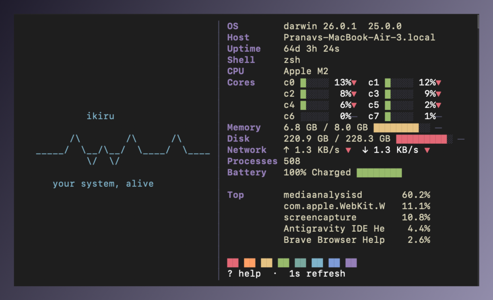

# ikiru

a live system vitals tui written in go. two-column layout with ascii art and real-time stats, powered by bubble tea.



## features

- os, kernel, hostname, uptime, shell, process count
- per-core cpu usage bars with trend arrows
- memory and disk usage with threshold colors
- network in/out per second
- battery percentage and state
- top 5 processes grouped by name
- kanagawa color theme
- responsive layout based on terminal width
- keybindings for interval, ascii style, compact mode, process toggle

## install

```sh
go install github.com/pranav718/ikiru@latest
```

## usage

```sh
ikiru
ikiru --once
ikiru --compact
ikiru --json
ikiru --interval 2
ikiru --ascii os
ikiru --no-color
```

## keybindings

```text
+/-        adjust refresh interval
[/]        adjust refresh interval (alt)
a          cycle ascii art style
c          toggle compact mode
n          toggle colors
p          toggle process panel
?          show help
q          quit
```

## flags

```text
--interval n    refresh interval in seconds (default: 1)
--once          print snapshot and exit
--compact       single column, no ascii art
--ascii style   ascii art: pulse, os, none
--no-color      disable colors
--json          print json snapshot and exit
```

## build from source

```sh
git clone https://github.com/pranav718/ikiru.git
cd ikiru
go build -o ikiru .
./ikiru
```
